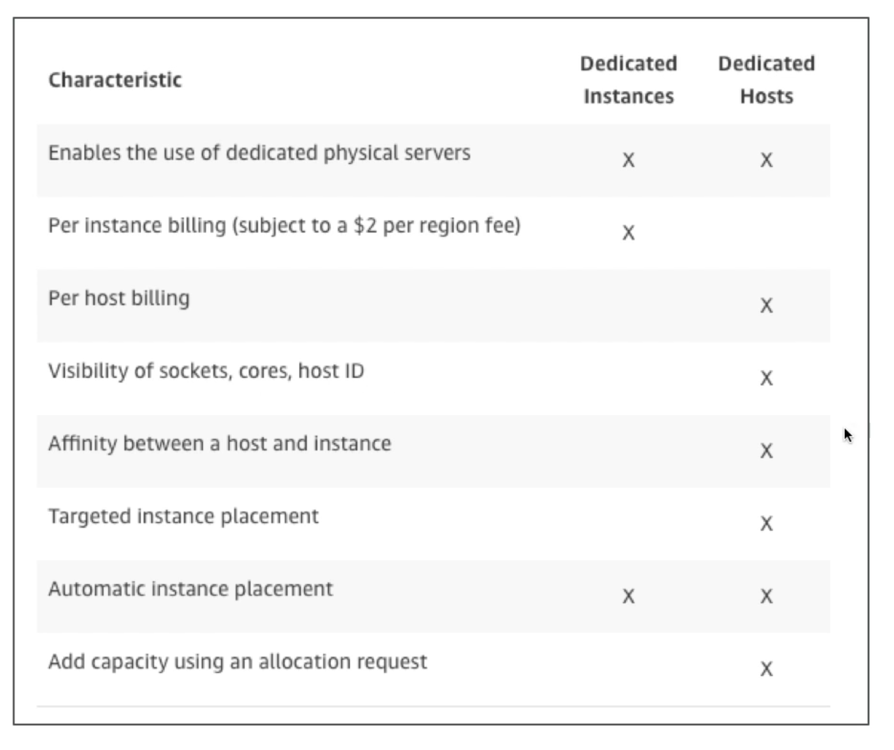

- **On Demand Instance:**

  - Used for Short workloads
  - Pay for what you want.
  - Billed per second, after the first minute.
  - Has higher cost then reserved instances, but no upfront payment.
  - Best for cases where you don't know how much workload you will need.

- **Reserved Instance:**

  - You can get upto **75%** discount on these workloads compared to on demand workloads.
  - You can pay upfront.
  - You can reserve the instance for 1 or 3 years.
  - **Simple Reserved:**
    - Best for when you are sure that you will need the instance for a long period of time.
    - Can be reserved for minimum of 1 year or long workloads.
    - You can reserve a specific type of instance. For example, if you will not need to change the type of server for you database.
  - **Convertible Reserved:**
    - You can reserve an instance for a time period but have the option to change the type (t2._, m2._, etc.) later on.
    - A little bit more expensive then simple reserved instances.
    - Upto **54%** discount.
  - **Scheduled Reserved:**
    - When you need an instance in a specific time frame for 1 year (minimum).
    - When you need an instance for a fraction of **day / week / month**.
    - **For example:** running a background job everyday at midnight to take backups of your database.

- **Spot Instance:**

  - Very cheap & the most cost efficient.
  - Up to **90%** discount.
  - You can loose your instance (least reliable).
  - There is a **max price**, which is the maximum amount you are willing to pay for that instance.
  - If the **spot price** of the instance goes above your max price, then you lose the instance.
  - Best for workloads which are highly resilient to failure.
    > **Note:** Resilient means being able to withstand or recover quickly.
  - **For example:**
    1. Batch processes which can be re-tried.
    2. Data analysis
    3. Image processing.
  - **Not recommended for:**
    1. Database (require long term commitment)
    2. Critical background jobs

- **Dedicated Instance:**

  - Your instance will be hosted on separate hardware. It will not be shared with anyone else.
  - Instance may share haardware with other instances, but only within your account.
  - You do not have control over placement of the instance. You can only move the hardware after you Stop / Start.

- **Dedicated Host:**
  - You book the entire physical EC2 server.
  - You control instance placement.
  - Visibilty into the underlying sockets and cores of the machine.
  - You need reserve it for a **3** year period.
  - More expensive.
  - **Common Use:**
    Useful for software that have a complicated licensing model.

### **Dedicated Host vs Dedicated Instance**

---

> **Question:** What does _instance placement_ mean. How does it differ for Dedicated instance and Dedicated hosts?

> **Exam Tip:** Dedicated hosts are for greater use cases then dedicated instances.
